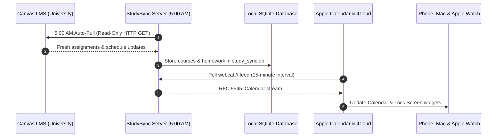

# StudySync

Self-hosted academic calendar and homework planner with Canvas LMS and Apple Calendar synchronization.

[](https://github.com/aiden0rchad/StudySync/releases)
[](LICENSE)
[](https://aiden0rchad.github.io/StudySync/)
[](https://buymeacoffee.com/aiden0rchad)

**[Explore the complete documentation →](https://aiden0rchad.github.io/StudySync/)**
Setup guides, Canvas integration details, Apple Calendar webcal configuration, Tailscale deployment, MCP tool definitions, and operations—with full-text search and light/dark themes.

StudySync connects your university Canvas courses to Apple Calendar and native iOS widgets. It runs as a self-hosted web app and local Progressive Web App (PWA), parses course syllabi and assignments using local or hosted LLMs, and exposes an RFC-compliant Model Context Protocol (MCP) server for local agent workflows.

Your university account remains untouched. StudySync operates on an explicit read-only guarantee: it fetches assignments and timetable data using HTTP GET requests and never writes back to Canvas.

## Current release: v0.1.3

Released September 9, 2026. [Read the release notes](https://github.com/aiden0rchad/StudySync/releases/tag/v0.1.3).

- **ADHD Guided Task Wizard**: Progressive 3-step interactive questionnaire modal replacing monolithic "wall of text" inputs to eliminate executive dysfunction and form paralysis. Provides 1-tap category presets (Homework, Quiz, Exam, Appointment, Work, Personal) with contextual title placeholders, 1-tap date/time presets (`Today`, `Tomorrow`, `Midnight`, `Evening`), duration pills (`15m`–`120m`), priority tags, and collapsible notes.
- **Authentic Royalty-Free 65s Soundscapes & 0ms Gapless Engine**: Studio recordings of Rain Drops, Crackling Campfire, and Midnight Cafe ambience, plus Deep Brown Noise, 40Hz Gamma Focus binaural beats, and Cyber Drone. Engineered with a 65.0s loop duration and a 5.0-second equal-power sinusoidal crossfade ($g_{out}^2 + g_{in}^2 = 1.0$) to eliminate audible loop seams and ear fatigue. Includes zero-latency synchronous audio start and automatic `AudioContext` resumption.
- **Atmospheric Lofi Backdrops & Room Themes**: 5 high-resolution ambient environments (**Rainy Tokyo**, **Midnight Cafe**, **Gothic Library**, **Cyberpunk Terminal**, and **Zen Sanctuary**) tastefully integrated into the Focus Room and fullscreen Lock-In Mode with frosted glass cards.
- **Clean Academic Telemetry & 5-Minute Momentum Gateway**: Replaced arcade elements with dignified scholar telemetry:
  - **Exam Preparedness Target**: Live $0\% \rightarrow 100\%$ readiness progress bar calculating deep-work study minutes invested against upcoming exam weights.
  - **5-Minute Momentum Gateway (Activation Protocol)**: Targeted 300-second friction-breaker countdown clock to conquer task initiation paralysis, with 1-click seamless rollover into 25m Pomodoro focus blocks.
  - **10-Tier Scholarly Hierarchy**: Dignified progression from Apprentice Scholar to Distinguished Fellow.
- **Consolidated Navigation Header Dock**: Clean icon dock (`[ 🔄 Sync ▾ | 🔊 | ☀️ | ⋮ ]`) that prevents visual clutter on mobile and desktop viewports.
- **PolyForm Noncommercial 1.0.0 License**: 100% free for students, researchers, homelabbers, and personal academic study; commercial exploitation prohibited without prior written permission.
- **Admin Progress Reset**: Direct progress/level wiping without affecting core courses or homework data (`POST /api/gamification/reset` and `POST /api/admin/wipe` with `target="progress"`).

## What it provides

- **ADHD Guided Task Wizard**: 3-step friction-free questionnaire modal with 1-tap presets that makes adding assignments, quizzes, and personal events effortless.
- **Canvas Grades & GPA Advisor**: Pulls live academic standings, scores, and letter grades from Canvas; lets you set goal grades and calculates required test scores to reach them.
- **"Lock In" Hyperfocus Sensory Isolation**: Fullscreen blackout mode isolating only your next critical task with an escape hatch (`Esc`), countdown timer, atmospheric backdrops, and ADHD micro-step checklist.
- **Authentic 65s Studio Soundscapes & Lofi Themes**: Zero-latency 0ms gapless looping of real studio rain, campfire, cafe, brown noise, cyber drone, and 40Hz gamma focus tones across 5 aesthetic environments.
- **Exam Preparedness & Momentum Telemetry**: $0\% \rightarrow 100\%$ exam readiness tracking paired with a 5-minute activation gateway to defeat executive dysfunction.
- **Discord ADHD & Procrastination Coach**: Psychologically engineered webhooks delivering micro-step prompts to overcome executive dysfunction, roast doomscrolling habits, or frame impending exams as high-stakes battles.
- **Dopamine Study Feed & Active Recall**: Bite-sized flashcards and micro-quizzes with vertical touch swipe navigation, spaced repetition scoring, and streak tracking.
- **Syllabus and schedule scanning**: Extract course codes, meeting times, locations, and assignment due dates from PDF files, syllabus images, or camera captures directly into your calendar.
- **Zero-touch capture and iOS Shortcuts**: Dedicated webhook (`POST /api/capture`) with pre-configured Apple Shortcuts for the iOS Share Sheet and Siri, plus Scriptable widgets for the iPhone Home and Lock Screen.
- **Smart alarms and Apple Maps geotags**: Generates tailored `VALARM` triggers (15m before class, 24h and 2h before exams) and embeds `GEO` / `X-APPLE-STRUCTURED-LOCATION` tags for native iOS "Time to Leave" walking alerts.
- **Morning briefing and Autopilot study blocking**: Automated 7:00 AM daily executive summary delivered via `ntfy.sh` or webhooks, paired with an autopilot allocator that converts pending deadlines into protected study blocks in open timetable gaps.
- **Read-only Canvas LMS integration**: Import enrolled courses, homework deadlines, and exam schedules via Canvas iCal URL or personal access token. All Canvas queries strictly use HTTP `GET`.
- **Daily background synchronization**: A local scheduler queries Canvas daily at 5:00 AM to pull syllabus and assignment changes. If your server or laptop was asleep at 5:00 AM, it catches up automatically upon waking.
- **Apple Calendar and iCloud subscription**: Exposes a `webcal://` feed formatted with RFC 5545 compliance. When added to Apple Calendar on macOS, iCloud propagates the feed across your iPhone, iPad, and Apple Watch.
- **Progressive Web App (PWA)**: Standalone mobile UI with safe-area padding for the iPhone notch and home indicator (`pb-safe`), offline asset caching, and touch-optimized controls without iOS input zoom.
- **Model Context Protocol (MCP) server**: 17 RFC-compliant MCP tools integrating directly with Claude Desktop, Cursor, and Hermes Agent to inspect deadlines, dispatch Discord nudges, and manage courses.
- **Self-hosting and Tailscale support**: Runs either via Docker Compose or standalone Node.js. Server-side host detection automatically rewrites webcal subscription URLs to match incoming Tailscale MagicDNS hostnames.

## Security, Safety & Project Boundaries

> **Disclaimer**: Tested on my end by the author, but has not been independently audited by a third-party cybersecurity firm. I tried my best to inspect, look, update, and patch vulnerabilities.

For full technical details, threat models, and safe deployment guides, see [.github/SECURITY.md](.github/SECURITY.md) and the [Security & Safety Documentation](https://aiden0rchad.github.io/StudySync/guide/security-safety).

- **Read-only Canvas guarantee**: StudySync strictly communicates with Canvas LMS via HTTP `GET` requests. It contains no API endpoints, database mutations, or code paths that send `POST`, `PUT`, `PATCH`, or `DELETE` requests to Canvas. Wiping or editing items in StudySync only alters your local SQLite database (`study_sync.db`).
- **Local-first storage & zero telemetry**: All user data, courses, tasks, and credentials reside in your local SQLite database or browser storage. No data is sent to external servers other than direct LLM inference requests to your configured AI provider (or 100% offline via local Ollama).
- **SSRF and injection defenses**: Outbound requests block cloud metadata endpoints (`169.254.169.254`) and loopbacks by default. Database queries strictly use parameterized prepared statements, and calendar feeds escape RFC 5545 delimiters to prevent CRLF injection.
- **Admin reset safety**: Clearing the database requires explicit confirmation. Once cleared, the database sets a persistent `has_been_seeded: 1` flag so server or container restarts do not inject sample courses back into your calendar.
- **Automated security verification suite**: Run `npm run test:security` to execute 19 automated tests verifying SSRF rejection, SQL injection protection, Discord webhook validation, CRLF sanitization, and `npm audit` dependency checks.

## Daily sync architecture



## Running StudySync

### Option 1: Docker Compose (Multi-Arch: ARM64 & AMD64)

StudySync's multi-stage container natively supports both **ARM64** (Apple Silicon M-series, AWS Graviton, Raspberry Pi 4/5) and **AMD64** (Intel/AMD x86_64). Because StudySync utilizes Node 22's built-in `node:sqlite`, there are no native C++ bindings (`node-gyp`) to compile.

```sh
git clone https://github.com/aiden0rchad/StudySync.git
cd StudySync
docker compose up -d
```

Or run directly from GitHub Container Registry without cloning:
```sh
docker run -d \
  --name studysync \
  -p 3000:3000 \
  -v studysync_data:/app/data \
  --restart unless-stopped \
  ghcr.io/aiden0rchad/studysync:latest
```

Open [http://localhost:3000](http://localhost:3000). Data is persisted in the Docker volume `studysync_data`.

To build for specific architectures explicitly:
```sh
npm run docker:build:arm64      # Apple Silicon / ARM64
npm run docker:build:amd64      # Intel / AMD64
npm run docker:build:multiarch  # Dual-manifest multi-arch
```

### Option 2: Standalone Node.js

Requirements: Node.js 20 or newer.

```sh
git clone https://github.com/aiden0rchad/StudySync.git
cd StudySync
npm install
npm run build
node server/server.js
```

Open [http://localhost:3001](http://localhost:3001) (or the port defined in `PORT`).

## Subscribing in Apple Calendar

1. In StudySync, open **Sync** in the top navigation and select **Apple Calendar & iCloud**.
2. Copy the webcal subscription URL.
3. In Apple Calendar on macOS, press <kbd>⌥⌘S</kbd> (or go to **File** → **New Calendar Subscription...**).
4. Paste the webcal URL and click **Subscribe**.
5. Set **Location** to **iCloud** to sync with your iPhone and iPad, and set **Auto-refresh** to **Every 15 minutes**.

If accessing StudySync over a Tailscale network, open StudySync via your Tailscale machine name (e.g. `http://my-server.tailnet-xyz.ts.net:3000`). StudySync will detect the host header and generate the webcal URL using your Tailscale address.

## Model Context Protocol (MCP) integration

StudySync provides an MCP server in `mcp/server.js` implementing 13 tools for inspecting calendars, retrieving homework, creating events, optimizing schedules, and wiping data.

Add the server to your Hermes Agent or Claude Desktop configuration:

```json
{
  "mcpServers": {
    "studysync": {
      "command": "node",
      "args": ["/absolute/path/to/StudySync/mcp/server.js"],
      "env": {
        "API_BASE": "http://localhost:3000/api"
      }
    }
  }
}
```

## Documentation

The full documentation site is built with VitePress and deployed to GitHub Pages:

- **Online**: [https://aiden0rchad.github.io/StudySync/](https://aiden0rchad.github.io/StudySync/)
- **Local preview**:
  ```sh
  npm --prefix docs run dev
  ```

## Supporting Future Development

StudySync is free and open for all students, researchers, and self-hosters. If StudySync has helped you manage your semester, conquer procrastination, or save hours of manual calendar entry, consider buying me a coffee! Your support directly funds ongoing development, local and multimodal AI model evaluations, and hardware testing.

<p align="left">
  <a href="https://buymeacoffee.com/aiden0rchad" target="_blank">
    
  </a>
  &nbsp;&nbsp;
  <a href="https://buymeacoffee.com/aiden0rchad" target="_blank">
    
  </a>
</p>

## License & Usage

Released under the **[PolyForm Noncommercial License 1.0.0](LICENSE)**.

* **Free for Personal & Non-Commercial Use**: 100% free to view, download, modify, self-host, and inspect for students, personal study, researchers, homelabbers, and educational organizations.
* **Commercial Restrictions**: For-profit companies and commercial entities may **not** sell, monetize, or package this code into commercial products without prior written authorization from the copyright holder.

### Commercial Licensing & Permission Requests
If you are an enterprise, institution, or commercial entity interested in using, white-labeling, or licensing StudySync, please reach out directly:
* **Author**: Roland Leyco
* **GitHub**: [@aiden0rchad](https://github.com/aiden0rchad)
* **Inquiries**: Open a GitHub issue or contact via [https://github.com/aiden0rchad/StudySync](https://github.com/aiden0rchad/StudySync)

