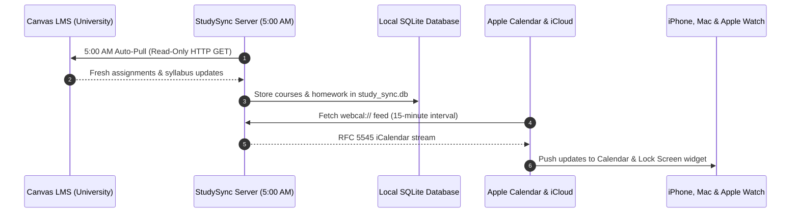

# StudySync

Self-hosted, AI-powered academic calendar & homework planner with Canvas LMS and Apple Calendar synchronization.

[](https://github.com/aiden0rchad/StudySync/releases)
[](LICENSE)
[](https://aiden0rchad.github.io/StudySync/)
[](https://aiden0rchad.github.io/StudySync/getting-started/pwa-setup)
[](https://aiden0rchad.github.io/StudySync/operations/docker)

**[Explore the complete documentation →](https://aiden0rchad.github.io/StudySync/)**
Capabilities, guided setup, Canvas integration, Apple Calendar webcal feeds, Tailscale networking, Hermes Agent MCP tools, and troubleshooting—with full-text search and dark/light themes.

---

## What StudySync Does

StudySync bridges the gap between university course portals (Canvas LMS), modern multimodal AI (syllabus scanning), and your native ecosystem (Apple Calendar, iPhone lock screen widgets, and Progressive Web Apps).

* **🤖 Multimodal AI Assistant**: Photograph or drag-and-drop course syllabi, lecture slides, or homework sheets. Compatible with **Gemini**, **OpenAI**, **Anthropic**, **Ollama**, **OpenRouter**, **Groq**, **DeepSeek**, and **Mistral**.
* **🎓 100% Read-Only Canvas LMS Pull**: Safely pulls enrolled courses, assignment deadlines, and exam schedules using HTTP `GET` exclusively. Never modifies or deletes anything on your university account.
* **⏰ Automated Daily 5:00 AM Sync**: Background engine automatically wakes at 5:00 AM every morning to pull fresh Canvas changes, with intelligent catch-up on machine wake.
* **🍎 Live Apple Calendar & iCloud Webcal Feed**: Standards-compliant RFC 5545 feed with 15-minute refresh directives (`REFRESH-INTERVAL: PT15M`). Subscribing on Mac mirrors automatically to iPhone and Apple Watch via iCloud.
* **📱 Native Mobile Ergonomics & PWA**: Full-screen standalone app with iOS notch/home-indicator padding (`pb-safe`), bottom navigation bar, quick-add button, app shortcuts, and zero input zoom on iOS.
* **🔌 Hermes Agent & Model Context Protocol (MCP)**: Built-in 13-tool MCP server allowing Claude Desktop and autonomous Hermes agents to plan your semester directly.
* **🐳 Tailscale & Docker Self-Hosting**: Built-in dynamic host detection adapts calendar feeds to your Tailscale MagicDNS address automatically.

---

## The Complete Daily Automation Loop



---

## Quick Start Options

### Option 1: Docker Compose (Recommended)

```bash
# 1. Clone the repository
git clone https://github.com/aiden0rchad/StudySync.git
cd StudySync

# 2. Launch container in background
docker compose up -d
```

Open [http://localhost:3000](http://localhost:3000). All schedule data is stored in the persistent Docker volume `studysync_data`.

---

### Option 2: Run with Node.js (Standalone)

Requirements: **Node.js 20+**

```bash
# 1. Clone and install dependencies
git clone https://github.com/aiden0rchad/StudySync.git
cd StudySync
npm install

# 2. Build production assets & launch
npm run build
node server/server.js
```

The application will be available at [http://localhost:3001](http://localhost:3001) (or port configured in `PORT`).

---

## Apple Calendar & iCloud Sync Setup

1. Open StudySync → Click **Sync** in the top bar → Select **Apple Calendar & iCloud**.
2. On your Mac, open the **Calendar** app.
3. Click **File** → **New Calendar Subscription...** (<kbd>⌥⌘S</kbd>).
4. Paste your StudySync webcal URL and click **Subscribe**.
5. Set **Location: iCloud** (so it syncs to your iPhone) and **Auto-refresh: Every 15 minutes**.

---

## Canvas LMS Integration & Read-Only Guarantee

StudySync connects to your university Canvas account using either:
1. **Calendar Feed URL** (*Canvas → Calendar → Calendar Feed*): Easiest setup, zero permissions needed.
2. **REST API Access Token** (*Canvas → Account → Settings → New Access Token*): Full syllabus sync.

> [!NOTE]
> **Zero Risk Guarantee:** StudySync contains no code or endpoints capable of creating, modifying, or deleting records on Canvas LMS. Wiping data in StudySync only purges local SQLite cache and sample courses.

---

## Hermes Agent & MCP Setup

StudySync includes an RFC-compliant Model Context Protocol server in `mcp/server.js`.

To connect with Hermes Agent, add to `hermes-mcp.json`:
```json
{
  "mcpServers": {
    "studysync": {
      "command": "node",
      "args": ["/path/to/StudySync/mcp/server.js"],
      "env": {
        "API_BASE": "http://localhost:3000/api"
      }
    }
  }
}
```

---

## Documentation

The full documentation site is powered by VitePress:
* **Online**: [https://aiden0rchad.github.io/StudySync/](https://aiden0rchad.github.io/StudySync/)
* **Local development**:
  ```bash
  npm --prefix docs run dev
  ```

---

## License

Released under the [MIT License](LICENSE). Built for students, homelabbers, and self-hosters.
