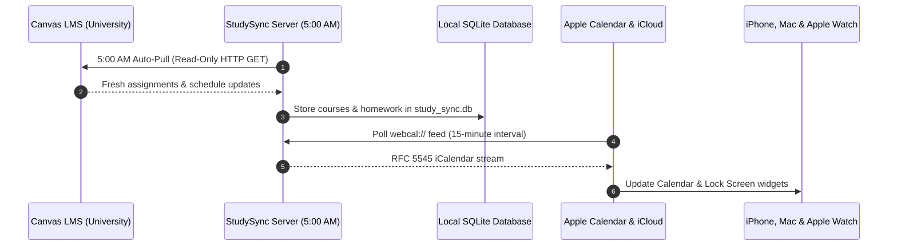

# StudySync

Self-hosted academic calendar and homework planner with Canvas LMS and Apple Calendar synchronization.

[](https://github.com/aiden0rchad/StudySync/releases)
[](LICENSE)
[](https://aiden0rchad.github.io/StudySync/)

**[Explore the complete documentation →](https://aiden0rchad.github.io/StudySync/)**
Setup guides, Canvas integration details, Apple Calendar webcal configuration, Tailscale deployment, MCP tool definitions, and operations—with full-text search and light/dark themes.

StudySync connects your university Canvas courses to Apple Calendar and native iOS widgets. It runs as a self-hosted web app and local Progressive Web App (PWA), parses course syllabi and assignments using local or hosted LLMs, and exposes an RFC-compliant Model Context Protocol (MCP) server for local agent workflows.

Your university account remains untouched. StudySync operates on an explicit read-only guarantee: it fetches assignments and timetable data using HTTP GET requests and never writes back to Canvas.

## Current release: v0.1.1

Released September 6, 2026. [Read the release notes](https://github.com/aiden0rchad/StudySync/releases/tag/v0.1.1).

- **Discord ADHD & Procrastination Coach**: Dedicated Discord webhook integration engineered specifically for neurodivergent students and chronic procrastinators. Features 4 distinct psychological motivation modes (ADHD Micro-Step, Spicy Duolingo-style roast, Gamified Boss Battle with ASCII HP bars, and Gentle Body-Doubling).
- **Automated Quiz & Exam Discord Alerts**: Background daemon scans the schedule and automatically dispatches pre-quiz warnings 24 hours and 2 hours prior with live Discord relative countdown timestamps (`<t:UNIX:R>`).
- **Unified Calendar Hub**: Consolidated Month, Week (Timetable), Day, and 14-Day Agenda into a single clutter-free view.
- **Dopamine Study Feed & Focus Room**: Brain-Scroll active recall feed that replaces doomscrolling with micro-learning, paired with an ambient Pomodoro Focus Lounge and Scholar Rank XP gamification.
- **Critical DND-Bypass Mobile Alerts**: Priority 5 emergency alerts via `ntfy.sh` that bypass Do Not Disturb / Silent mode on iOS and Android phones for imminent deadline pushes.
- **Enhanced AI & 16-Tool MCP Server**: Dedicated tools for personal events/appointments (doctors, dentist, meetings), schedule-wide search, and on-demand Discord nudges.

## What it provides

- **Discord ADHD & Procrastination Coach**: Psychologically engineered webhooks delivering micro-step prompts to overcome executive dysfunction, roast doomscrolling habits, or frame impending exams as high-stakes RPG boss battles.
- **Dopamine Study Feed & Ambient Focus Lounge**: Bite-sized active recall quizzes, procedural ambient focus audio (Rain, White Noise, Campfire, Cyber Drone, Lo-Fi Cafe), and streak/level progression.
- **Syllabus and schedule scanning**: Extract course codes, meeting times, locations, and assignment due dates from PDF files, syllabus images, or camera captures directly into your calendar.
- **Zero-touch capture and iOS Shortcuts**: Dedicated webhook (`POST /api/capture`) with pre-configured Apple Shortcuts for the iOS Share Sheet and Siri, plus Scriptable widgets for the iPhone Home and Lock Screen.
- **Smart alarms and Apple Maps geotags**: Generates tailored `VALARM` triggers (15m before class, 24h and 2h before exams) and embeds `GEO` / `X-APPLE-STRUCTURED-LOCATION` tags for native iOS "Time to Leave" walking alerts.
- **Morning briefing and Autopilot study blocking**: Automated 7:00 AM daily executive summary delivered via `ntfy.sh` or webhooks, paired with an autopilot allocator that converts pending deadlines into protected study blocks in open timetable gaps.
- **Read-only Canvas LMS integration**: Import enrolled courses, homework deadlines, and exam schedules via Canvas iCal URL or personal access token. All Canvas queries strictly use HTTP `GET`.
- **Daily background synchronization**: A local scheduler queries Canvas daily at 5:00 AM to pull syllabus and assignment changes. If your server or laptop was asleep at 5:00 AM, it catches up automatically upon waking.
- **Apple Calendar and iCloud subscription**: Exposes a `webcal://` feed formatted with RFC 5545 compliance. When added to Apple Calendar on macOS, iCloud propagates the feed across your iPhone, iPad, and Apple Watch.
- **Progressive Web App (PWA)**: Standalone mobile UI with safe-area padding for the iPhone notch and home indicator (`pb-safe`), offline asset caching, and touch-optimized controls without iOS input zoom.
- **Model Context Protocol (MCP) server**: 16 RFC-compliant MCP tools integrating directly with Claude Desktop, Cursor, and Hermes Agent to inspect deadlines, dispatch Discord nudges, and manage courses.
- **Self-hosting and Tailscale support**: Runs either via Docker Compose or standalone Node.js. Server-side host detection automatically rewrites webcal subscription URLs to match incoming Tailscale MagicDNS hostnames.

## Project boundaries and data safety

- **No write access to Canvas**: StudySync has no API endpoints, database mutations, or code paths that send `POST`, `PUT`, `PATCH`, or `DELETE` requests to Canvas LMS. Wiping or editing items in StudySync only alters your local SQLite database (`study_sync.db`).
- **Local-first storage**: All user data, courses, tasks, and credentials reside in your local SQLite database or browser storage. No data is sent to external servers other than direct LLM inference requests to your configured AI provider.
- **Admin reset safety**: Clearing the database requires explicit confirmation. Once cleared, the database sets a persistent `has_been_seeded: 1` flag so server or container restarts do not inject sample courses back into your calendar.

## Daily sync architecture



## Running StudySync

### Option 1: Docker Compose

Docker Compose runs the compiled web application, API server, and SQLite database in a single container with a persistent volume:

```sh
git clone https://github.com/aiden0rchad/StudySync.git
cd StudySync
docker compose up -d
```

Open [http://localhost:3000](http://localhost:3000). Data is stored in the persistent Docker volume `studysync_data`.

### Option 2: Standalone Node.js

Requirements: Node.js 20 or newer.

```sh
git clone https://github.com/aiden0rchad/StudySync.git
cd StudySync
npm install
npm run build
node server/server.js
```

Open [http://localhost:3001](http://localhost:3001) (or the port defined in `PORT`).

## Subscribing in Apple Calendar

1. In StudySync, open **Sync** in the top navigation and select **Apple Calendar & iCloud**.
2. Copy the webcal subscription URL.
3. In Apple Calendar on macOS, press <kbd>⌥⌘S</kbd> (or go to **File** → **New Calendar Subscription...**).
4. Paste the webcal URL and click **Subscribe**.
5. Set **Location** to **iCloud** to sync with your iPhone and iPad, and set **Auto-refresh** to **Every 15 minutes**.

If accessing StudySync over a Tailscale network, open StudySync via your Tailscale machine name (e.g. `http://my-server.tailnet-xyz.ts.net:3000`). StudySync will detect the host header and generate the webcal URL using your Tailscale address.

## Model Context Protocol (MCP) integration

StudySync provides an MCP server in `mcp/server.js` implementing 13 tools for inspecting calendars, retrieving homework, creating events, optimizing schedules, and wiping data.

Add the server to your Hermes Agent or Claude Desktop configuration:

```json
{
  "mcpServers": {
    "studysync": {
      "command": "node",
      "args": ["/absolute/path/to/StudySync/mcp/server.js"],
      "env": {
        "API_BASE": "http://localhost:3000/api"
      }
    }
  }
}
```

## Documentation

The full documentation site is built with VitePress and deployed to GitHub Pages:

- **Online**: [https://aiden0rchad.github.io/StudySync/](https://aiden0rchad.github.io/StudySync/)
- **Local preview**:
  ```sh
  npm --prefix docs run dev
  ```

## License

Released under the [MIT License](LICENSE).
