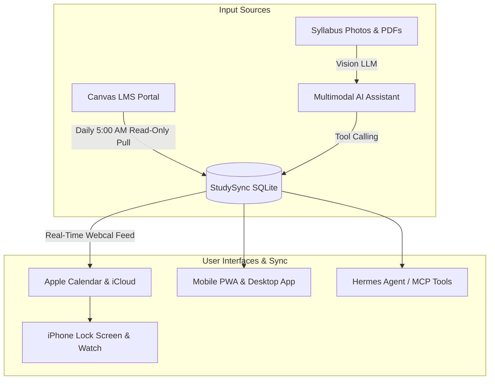

# What is StudySync?

**StudySync** is a self-hosted academic calendar, timetable, and homework management system designed specifically for students, researchers, and homelabbers.

Unlike generic calendar tools, StudySync bridges the gap between your university's course portal (Canvas LMS), your daily planning routine (multimodal LLMs scanning syllabi), and your native devices (Apple Calendar, iOS widgets, and Progressive Web Apps).

---

## The Problem with University Calendars

University students face unique scheduling challenges:
1. **Scattered Information**: Lecture times are in course PDF syllabi, homework is posted to Canvas LMS, personal study sessions are in Apple Calendar.
2. **Manual Entry Fatigue**: Manually typing in every quiz, problem set, lab report, and reading assignment from 5 different syllabi is error-prone.
3. **Stale Calendars**: Homework deadlines move when professors adjust due dates, requiring constant manual updates.
4. **Cloud Privacy**: Students want full ownership of their schedule and local privacy without relying on third-party cloud aggregators.

---

## The StudySync Solution

StudySync unifies your entire academic life into one automated, self-hosted stack:

### Core Highlights
* **Zero-Touch Morning Freshness**: A daily 5:00 AM background synchronization scheduler queries Canvas LMS every morning and updates SQLite.
* **Apple Calendar Native Feed**: Generates standard RFC 5545 `.ics` webcal feeds with `REFRESH-INTERVAL: PT15M` directives.
* **Hermes Agent & MCP Ready**: Built-in Model Context Protocol server lets local LLMs manage your timetable autonomously.
* **Safe Clean Slate**: Wipe sample demo items at any time without ever affecting your school's Canvas account.
* **Free for Personal & Non-Commercial Use**: Released under the **PolyForm Noncommercial License 1.0.0**. Free for all students, self-hosters, and personal study. Commercial use or monetization requires prior written permission from the author.

