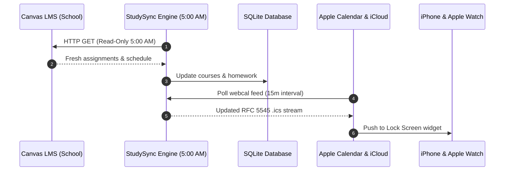

# Daily 5:00 AM Automation

StudySync includes a built-in background scheduler (`server/scheduler.js`) that runs automatically every morning at **5:00 AM local time**.

---

## Why 5:00 AM?

Professors and TAs frequently update deadlines, cancel classes, or post new assignments late in the evening. Running the daily pull at 5:00 AM ensures that when you wake up in the morning, your schedule is 100% fresh and accurate.



---

## Automatic Sleep / Wake Catch-Up

Many students run StudySync on a laptop or homelab mini-PC that might be asleep overnight.

StudySync solves this with **intelligent catch-up**:
* When your machine wakes up or boots after 5:00 AM, StudySync checks the last recorded daily sync date in SQLite.
* If today's 5:00 AM sync has not run yet, StudySync **immediately triggers a catch-up sync** in the background.
* You never miss an update, even if your laptop was closed all night.

---

## Testing the Daily Sync Manually

You can trigger the daily automation engine at any time via the API:
```bash
curl -X POST http://localhost:3000/api/canvas/scheduler/run
```

Or view scheduler telemetry:
```bash
curl -s http://localhost:3000/api/canvas/scheduler
```
