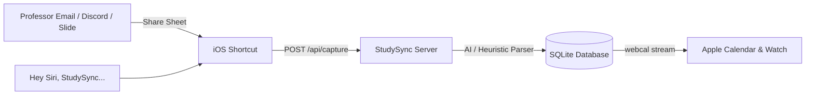

# iOS Shortcuts, Siri & Quick Capture

StudySync provides a dedicated zero-touch capture webhook (`POST /api/capture`) designed for iOS Shortcuts, the system Share Sheet, and Siri voice commands.

This allows you to capture assignments, lecture changes, and syllabus snippets directly from your iPhone without opening the web interface.

---

## Overview



When you trigger the shortcut:
1. The text or image is sent directly to your StudySync instance.
2. The server analyzes the text using regex heuristics or the configured multimodal AI assistant.
3. The course or task is created in SQLite.
4. The event syncs automatically to Apple Calendar on your Mac, iPhone, and Apple Watch via iCloud.

---

## Setting Up the iOS Shortcut

You can set up the shortcut in Apple's built-in **Shortcuts** app in under two minutes.

### Step 1: Create the Shortcut

1. Open **Shortcuts** on iPhone or iPad and tap **(+)**.
2. Name the shortcut: `Send to StudySync`.
3. Tap the **(i)** details icon at the bottom:
   - Enable **Show in Share Sheet**.
   - Under **Share Sheet Types**, select **Text** and **Images**.

### Step 2: Add Actions

Add the following actions in order:

```text
Action 1: Get Contents of URL
  URL: http://<your-server-ip-or-tailscale-host>:3000/api/capture
  Method: POST
  Headers:
    Content-Type: application/json
  Request Body: JSON
    text: Shortcut Input

Action 2: Show Notification
  Text: "StudySync: Captured task successfully!"
```

### Step 3: Test with Siri

Because the shortcut is named `Send to StudySync`, you can trigger it with your voice:
> *"Hey Siri, Send to StudySync: Math 201 Homework 4 due Friday at 5 PM"*

---

## iPhone Home & Lock Screen Widget (Scriptable)

StudySync includes a ready-to-run [Scriptable](https://scriptable.app/) script that renders your next class, room number, live countdown, and tasks due today.

### Setup Instructions

1. Install **Scriptable** from the iOS App Store.
2. Open StudySync → Click **Sync** → Select **iOS Shortcuts & Share Sheet** → Open the **iOS Scriptable Widget** tab.
3. Tap **Download StudySyncWidget.js** or copy the script.
4. In Scriptable, tap **(+)**, paste the code, and name it `StudySync`.
5. On your iPhone Home Screen:
   - Long press to enter jiggle mode.
   - Tap **(+)** in the top corner and search for **Scriptable**.
   - Select the **Medium** widget.
   - Tap the widget to edit it and choose `StudySync`.

The widget automatically polls your StudySync instance and updates throughout the day.
